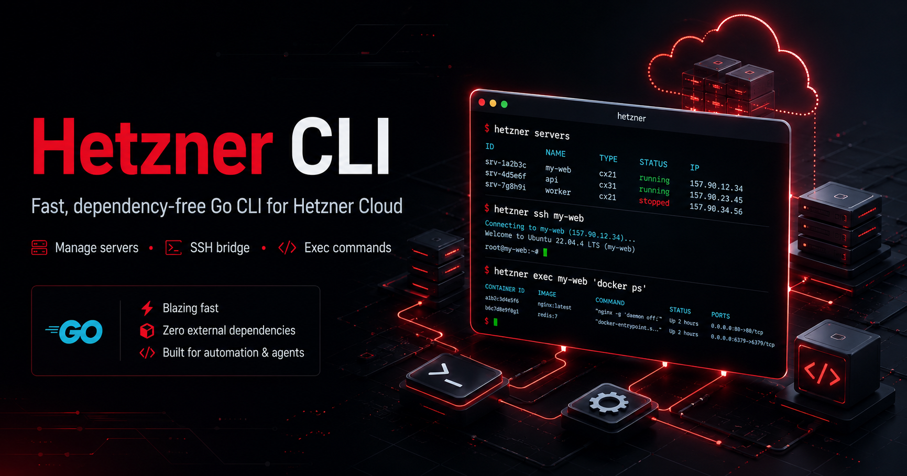

<p align="center">
  
</p>

<p align="center">
  <a href="https://github.com/Dakaric/hetzner-cli/actions/workflows/ci.yml"></a>
  <a href="https://github.com/Dakaric/hetzner-cli/releases/latest"></a>
  <a href="LICENSE"></a>
  
  
</p>

# hetzner

A small, fast, dependency-free CLI for the [Hetzner Cloud](https://www.hetzner.com/cloud) API — plus a built-in SSH bridge so the same tool that *manages* your servers can also *get you a shell on them*.

Written in Go, standard library only. Single static binary. Runs on macOS, Linux, and Windows (PowerShell).

> Unofficial. Not affiliated with or endorsed by Hetzner. It talks to the public Hetzner Cloud API with a token you provide.

## Two planes, one tool

| Plane | What | Commands |
|-------|------|----------|
| **Control** | The infrastructure: list, create, reboot, resize, delete servers/volumes/networks/firewalls/IPs | `hetzner servers`, `server create`, `volume`, `firewall`, `api …` |
| **Data** | Inside the box: run a command, read logs, install software, `docker ps` | `hetzner ssh <name>`, `hetzner exec <name> '<cmd>'` |

The control plane is the Hetzner Cloud API. The data plane is your system's OpenSSH client — the CLI just resolves a friendly server name to its IP and hands off to `ssh`. Nothing about SSH is reimplemented.

## Install

### One line — no Go, no clone

macOS / Linux:

```sh
curl -fsSL https://raw.githubusercontent.com/Dakaric/hetzner-cli/main/get.sh | sh
```

Windows (PowerShell):

```powershell
irm https://raw.githubusercontent.com/Dakaric/hetzner-cli/main/get.ps1 | iex
```

Downloads the prebuilt binary for your OS/arch, verifies it against the release's `SHA256SUMS`, puts it on your PATH, and prints the next step. Override the target dir with `HETZNER_BIN_DIR` or pin a tag with `HETZNER_VERSION=v0.1.0`.

### From source (needs [Go](https://go.dev/dl/) 1.24+)

```sh
git clone https://github.com/Dakaric/hetzner-cli.git
cd hetzner-cli
./install.sh          # macOS / Linux
# or, on Windows PowerShell:
#   .\install.ps1
```

The installer builds the binary, puts it on your PATH, and runs onboarding.

### Prebuilt binary (manual)

Grab the matching archive from the [Releases](https://github.com/Dakaric/hetzner-cli/releases) page, unpack it, and put `hetzner` (or `hetzner.exe`) anywhere on your PATH.

Every release ships a `SHA256SUMS` file. Verify a download before trusting it:

```sh
sha256sum -c SHA256SUMS --ignore-missing     # Linux
shasum -a 256 -c SHA256SUMS --ignore-missing # macOS
```

### Manual build

```sh
go build -o hetzner .
```

## Onboarding

### Get an API token

The CLI authenticates with a **project-scoped** Hetzner Cloud API token — it only ever sees the one project the token was created in.

1. Sign in to the [Hetzner Cloud Console](https://console.hetzner.cloud/) and **open the project** you want to manage (create one first if you have none).
2. In the left menu bar, click **Security**.
3. Switch to the **API tokens** tab in the upper menu.
4. Click **Generate API token**.
5. Enter a **description** (e.g. `hetzner-cli`) and pick a permission level:
   - **Read & Write** — required for anything that changes state (create/delete servers, reboots, volume attach, …). Pick this if in doubt.
   - **Read** — GET only; enough for `hetzner status`, `servers`, and other list/show commands.
6. Click **Generate API token**, then **copy the token immediately** — Hetzner shows it **only once** and you cannot view it again after closing the dialog.

### Then log in

```sh
hetzner login            # paste the token; it is validated against the API and saved
hetzner status           # confirms it works
```

`hetzner login` writes the token to a private per-user file:

- Linux/macOS: `~/.config/hetzner/env`
- Windows: `%APPDATA%\hetzner\env`

You can also skip `login` entirely and just export the token:

```sh
export HETZNER_API_KEY=...      # also accepts HETZNER_TOKEN / HCLOUD_TOKEN
```

The token is **project-scoped** — it only ever sees the one Cloud project it was created in.

## Usage

```sh
hetzner version                      # print the CLI version
hetzner status                       # inventory + connection test
hetzner servers                      # list servers
hetzner server my-web                # show one (by id or name)
hetzner server-types                 # machine sizes incl. monthly price
hetzner images --type system         # bootable images

# Lifecycle
hetzner server create --name web --type cx22 --image ubuntu-24.04 --location fsn1 --ssh-key my-key
hetzner server reboot my-web
hetzner server delete my-web --yes

# Get on the box
hetzner ssh my-web                   # interactive shell
hetzner exec my-web 'docker ps'      # one command, output streamed back

# Storage / network
hetzner volumes
hetzner volume create --name data --size 50 --location fsn1
hetzner networks
hetzner firewalls

# Anything the typed commands don't cover
hetzner api GET /servers
hetzner api POST /servers/123/actions/enable_rescue
```

Every list/show command takes `--json` for the full, scriptable payload. Servers, volumes, networks, firewalls and ssh-keys can be addressed by **id or name** interchangeably.

### SSH / exec details

```
hetzner ssh  <id|name> [--user root] [--key <path>] [--port 22]
hetzner exec <id|name> '<command>' [--user root] [--key <path>]
hetzner exec <id|name> -- <command with its own --flags>
```

Defaults: user `root`, key `~/.ssh/id_ed25519`. `exec` runs in batch mode (no password fallback, fails fast); `ssh` is fully interactive.

The remote command can be a single quoted argument (`hetzner exec my-web 'docker ps'`). If the command carries its own double-dash flags, put everything after a bare `--` so they reach the server intact instead of being parsed as `hetzner` flags:

```sh
hetzner exec my-web -- docker run --rm alpine echo hi
```

On Windows these need the OpenSSH client (`ssh.exe`) — enable *Settings → Apps → Optional Features → OpenSSH Client*.

## Safety

Destructive operations refuse to run without an explicit `--yes`:

- `… delete … --yes` for every resource
- `server poweroff` and `server reset` (hard power actions) need `--yes`
- `reboot`, `shutdown`, `poweron` are allowed without it

`--force` is accepted as an alias for `--yes`.

There is no interactive confirmation prompt by design — the tool is automation-friendly, so the gate is a flag you can see in the command. No telemetry, no network calls except to the Hetzner API (and your own servers over SSH).

## Configuration reference

| Variable | Purpose |
|----------|---------|
| `HETZNER_API_KEY` | Cloud API token (aliases: `HETZNER_TOKEN`, `HCLOUD_TOKEN`) |
| `HETZNER_BASE_URL` | API root, defaults to `https://api.hetzner.cloud/v1` |
| `HETZNER_ENV_FILE` | Pin a single dotenv file instead of the default search |

Resolution order: real environment variables first, then the dotenv candidates (`~/.config/hetzner/env`, `~/.claude/.env`, and `%APPDATA%\hetzner\env` on Windows). `hetzner config` shows exactly what was found (never the token value).

## Development

```sh
go test ./...        # unit tests (httptest-backed client, config, render, ssh args)
go vet ./...
go build -o hetzner .
```

The code is organized so each layer owns one thing:

- `client.go` — the only owner of the Hetzner API: auth, request plumbing, resource shapes
- `commands.go` — per-resource command handlers
- `ssh.go` — the control-plane → data-plane bridge
- `render.go` — human-readable output (`--json` bypasses it)
- `config.go` — token/dotenv resolution
- `main.go` — dispatch, flag parsing, onboarding, the destructive-op guard

Every push and pull request runs `go vet`, `go test`, and a build on Linux, macOS, and Windows via [GitHub Actions](.github/workflows/ci.yml).

### Releasing

Releases are cut by pushing a semver tag — [`release.yml`](.github/workflows/release.yml) cross-compiles every target, packages the archives, generates `SHA256SUMS`, and publishes a GitHub Release. The version is stamped into the binary, so `hetzner version` matches the tag.

```sh
git tag v0.2.0
git push origin v0.2.0
```

## Contributing

Bug reports and pull requests are welcome — see [CONTRIBUTING.md](CONTRIBUTING.md). For anything security-related, please follow [SECURITY.md](SECURITY.md) instead of opening a public issue.

## License

MIT — see [LICENSE](LICENSE).
